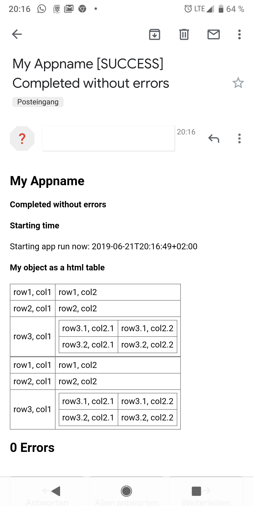

# logmailer
Log mailer for (Node) JS. Aggregate your log/error mail from all over your app and send it when you want.

[](https://www.npmjs.com/package/logmailer)
[](https://packagephobia.now.sh/result?p=logmailer)
[](https://www.npmjs.com/package/logmailer)


## logmailer uses emailjs

Please see here [npmjs.com/package/emailjs](https://www.npmjs.com/package/emailjs)! Without **emailjs** logmailer would not exist. Special thanks/credits to [eleith](https://github.com/eleith)!

## Purpose

Think of the following scenario: There are several events in your app and you want to be noticed about them via email. Well, if you have one notification, then you have one email. That's fine. But what if you have lots of notifications over runtime, thrown by functions scattered all over your app? Then you would have to aggregate all those notifications to a (log) file and send it when your app run is finished. Lots of loggers are able to write into files. But what if you want to have a well formatted html email? Then you can use **logmailer**. :)

## Features

- with **logmailer** you can aggregate error or log htmls everywhere in your app
- use as much html & css as you want (as long as it can be handled by email clients)
- format your objects or arrays of objects as beautiful html tables

## Planned Features

I would be happy to read your ideas. To be done.

## Installing

Using npm:

```bash
$ npm install logmailer
```

## How to use

### Set up the logmailer (initially)

file1.js (e.g. index.js or app.js)

```javascript
    let logMailer = require("logmailer");
    // import logMailer from "logmailer";

    logMailer.default.configureMailClient("smtp.googlemail.com", "user", "password", true);
```

### Use the logmailer

file2.js:

```javascript
    let logMailer = require("logmailer");
    // import logMailer from "logmailer";

    logMailer.default.addToLogHTML("Starting time", `Starting app run now: ${new Date().toISOString()}`);

    logMailer.default.addToErrorHTML("Error heading", "Info about error");
    //...
    logMailer.default.addToErrorHTML(null, "Further info about error");
    //...
    logMailer.default.addToErrorHTML(null, "Further info about error");
    //...
```

### Send the mail

```javascript
    logMailer.default.sendMail("myemailalias@whoop.com", "baerbel@gmail.com,gudrun@gmx.de", "My Appname", function (err) {
        if (err) {
            logger.error("error while sending", err);
        } else {
            logger.info("mail sent successfully");
        }
    });
```

### Reset your htmls

```javascript
    logMailer.default.resetErrorHTML();
    logMailer.default.resetLogHTML();
```

### Format objects or arrays of objects as html tables

```javascript
    let object = {
        "row1, col1": "row1, col2",
        "row2, col1": "row2, col2",
        "row3, col1": {
            "row3.1, col2.1": "row3.1, col2.2",
            "row3.2, col2.1": "row3.2, col2.2"
        }
    }
    logMailer.default.addToLogHTML("My object as a html table", logMailer.default.convertObjectToHTMLTable(object));

    let array = [object, object];

    logMailer.default.addToLogHTML("My object array as a html table", logMailer.default.convertObjectArrayToHTMLTable(array));
```

### Nice solution for Node JS

file1.js (e.g. index.js or app.js)

```javascript
    process.on('uncaughtException', function (err) {
        logger.error("uncaught exception", err);
        logMailer.default.addToErrorHTML("Uncaught exception", `&#9658; Error message: ${err.message}<br/>Error stack: ${err.stack}`);
    });

    process.on('unhandledRejection', function (err) {
        logger.error("uncaught rejection", err);
        logMailer.default.addToErrorHTML("Unhandled rejection", `&#9658; Error message: ${err.message}<br/>Error stack: ${err.stack}`);
        unplannedExit("rejection error");
    })

    function unplannedExit(info) {
        logger.error("unnormal exit:", info);
        logMailer.default.addToErrorHTML("Unnormal exit:", `&#9658; Info: ${info}`);
        fetcher.closeDB(function () {
            logMailer.default.addToLogHTML("Ending time", `Ending app run now: ${new Date().toISOString()}`);
            logger.info("send mail now");
            logMailer.default.sendMail("myemailalias@whoop.com", "baerbel@gmail.com,gudrun@gmx.de", "My Appname", function (err) {
                if (err) {
                    logger.error("error while sending", err);
                } else {
                    logger.info("mail sent successfully");
                }
                process.exit();
            });
        })
    }

    process.on('beforeExit', function (exitCode) {
        unplannedExit(exitCode);
    })

    process.on("SIGTERM", function (signal) {
        unplannedExit(signal);
    })

    process.on("SIGINT", function (signal) {
        unplannedExit(signal);
    })
```

## Screenshots




## License

MIT