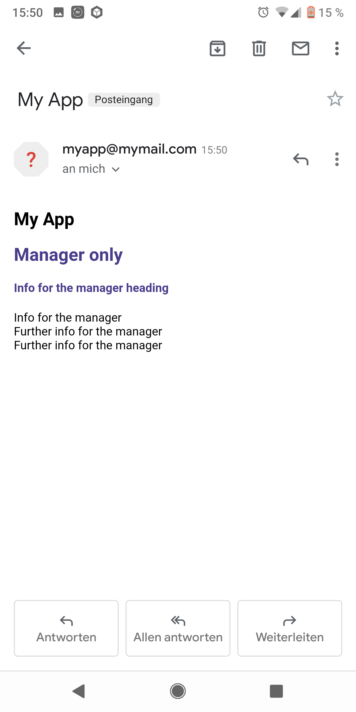

# logmailer
Log mailer for (Node) JS. Aggregate your log/error mail from all over your app and send it when you want.

[](https://www.npmjs.com/package/logmailer)
[](https://packagephobia.now.sh/result?p=logmailer)
[](https://www.npmjs.com/package/logmailer)


## logmailer uses emailjs

Please see here [npmjs.com/package/emailjs](https://www.npmjs.com/package/emailjs)! Without **emailjs** logmailer would not exist. Special thanks/credits to [eleith](https://github.com/eleith)!

## Purpose

Think of the following scenario: There are several events in your app and you want to be noticed about them via email. Well, if you have one notification, then you have one email. That's fine. But what if you have **lots of notifications over runtime, thrown by functions scattered all over your app**? Then you would have to aggregate all those notifications to a (log) file and send it when your app run is finished. Lots of loggers are able to write into files. But what if you want to have a **well formatted html email**? Then you can use **logmailer**. :)

## News

**Nov 09, 2019**
I am happy to announce that logmailer is **production ready**. 🎉 Logmailer proofed itself over the last 3 or 4 months within the context of my current side project, the [Globallytics Fund No. 1](https://globallytics.de/), which is a machine learning based fund. I use logmailer in several scripts running on our server. It is very stable and there weren't any issues all this time.

**Sep 29, 2019**
I just wrote an article about logmailer. You can find it on [Medium](https://medium.com/@mindactuate/log-mailer-for-node-js-e27648634934) and [Dev.to](https://dev.to/mindactuate/log-mailer-for-node-js-aggregate-your-log-error-mail-from-all-over-your-app-and-send-it-when-you-want-1oh1).

**Jun 28, 2020**
No news about the code but still using logmailer in heavy production and it works and works and works. :) Logmailer has generated and sent over 18.000 mails now during the first year of our ML based stock fund [Globallytics Fund No. 1](https://globallytics.de/). Logmailer is an irreplacable tool for us. We get notified on errors and also have a kind of documentation for the BAFIN like "hey, we know it and we immediately take action if something goes wrong".


## Features (over time)

- 0.0.3
  - with logmailer you can **add content to your log mail from anywhere**
  - use as much **html & css** as you want (as long as it can be handled by email clients)
  - the aggregated **mail can be sent** at the end of your app run, when your app crashes, or **just when you need it**
  - **format your objects** or arrays of objects as beautiful **html tables**
- 0.1.0
  - your mail is separated in **chapters** which are stacked on each other e.g. `"Summary" -> "Errors" -> "Warnings" -> "Logs" (StandardChapters)`
  - you can adjust **which mail recipient can see which chapters**, e.g. the manager is only allowed to see the (custom) chapter `"Management Summary"`
  - you can adjust that a specific **mail recipient only gets an email if a certain chapter is not empty**, e.g. I only want to receive an email personally if there is at least one error in the `"Errors"` chapter
- 1.0
  - just an announcement, that logmailer is production ready! no code changes! you can update without any problems
- ideas for the future
  - logmailer runs in a **separate process** which is *independent* to the original process
  - I would be happy to read your ideas

## Bug fixes (over time)

None

## Installing

Using npm:

```bash
$ npm install logmailer
```

## How to use

### Set up the logmailer (initially)

Create a file to create and configure the logmailer (e.g. logmailer.js). Make sure to export the logmailer itself and your chapters.

**logmailer.js**

```javascript
    let { logmailer, Recipient, Chapter, StandardChapters } = require("logmailer");
    // import { logmailer, Recipient, Chapter, StandardChapters } from "logmailer";

    // the order in this object is the order of the chapters in the email
    let chapters = {
        summary: StandardChapters.Summary,
        ffOnly: new Chapter("Firefighter only", false, "DeepPink"),
        managerOnly: new Chapter("Manager only", false, "DarkSlateBlue"),
        errors: StandardChapters.Errors,
        logs: StandardChapters.Logs
    }

    logmailer.create({
        appName: "My App",
        mailAlias: "myapp@mymail.com",
        client: {
            host: "smtp.googlemail.com",
            user: "user",
            password: "password",
            ssl: true
        },
        recipients: [
            "baerbel@gmx.de", // receives everything

            // receives email if the "managerOnly" chapter is not empty
            // receives only the chapter "managerOnly"
            new Recipient("guenther@gmail.com", [chapters.managerOnly], [chapters.managerOnly]),

            // receives email if the "ffOnly" chapter is not empty
            // receives only the chapters "ffOnly" and "errors"
            new Recipient("horst@web.de", [chapters.ffOnly], [chapters.summary, chapters.ffOnly, chapters.errors]),
        ],
        chapters: chapters
    })

    module.exports.logmail = chapters;
    module.exports.logmailer = logmailer;
```

#### Chapter class

`Chapter` is a single chapter object
```javascript
let Chapter: new (name: string, hasCount?: boolean, color?: string) => Chapter
```

Params:
- @param `name` — chapters name e.g. "Summary"
- @param `hasCount` — (optional, default is false) set to true if you want to count how often you added content to the chapter (good for errors or warnings)
- @param `color` — (optional, default is "black") use colors to colorize headlines (you can use hex, rgb, rgba, color codes etc. but it is important that the email client can display the color correctly)

#### Recipient class

`Recipient` a single recipient object
```javascript
let Recipient: new (emailAddress: string, getsEmailOnlyIfChaptersNotEmpty?: Chapter[], canOnlySeeChapters?: Chapter[]) => Recipient
```

Params:
- @param `emailAddress`
- @param `getsEmailOnlyIfChaptersNotEmpty` — (optional) array of chapters e.g. [chapters.errors], the recipient will get the email only if there is at least 1 logged error
- @param `canOnlySeeChapters` — (optional) array of chapters e.g. [chapters.summary, chapters.errors], the recipient can only see the summary and the logged errors

### Use the logmailer

In all your other files you can simply import your chapters and the logmailer and use them.

**myapp.js**

```javascript
    let { logmailer, logmail } = require("./logmailer");
    // import { logmailer, logmail } from "./logmailer";

    logmail.summary.add("Starting time", `Starting app run now: ${new Date().toISOString()}`);

    // ..

    logmail.errors.add("Error heading", "Info about error");
    logmail.errors.add(null, "Further info about error");
    logmail.errors.add(null, "Further info about error");

    // ..

    logmail.managerOnly.add("Info for the manager heading", "Info for the manager");
    logmail.managerOnly.add(null, "Further info for the manager");
    logmail.managerOnly.add(null, "Further info for the manager");

    // ..

    logmail.ffOnly.add("Info for the firefighter heading", "Instructions for the firefighter");
    logmail.ffOnly.add(null, "Further instructions");
    logmail.ffOnly.add(null, "Further instructions");
```

### Send the mail

```javascript
    logmailer.sendMail(err => {
        if (err) {
            console.log("error while sending", err);
        } else {
            console.log("mail sent successfully");
        }
    })
```

### Reset your chapters

```javascript
    logmail.errors.reset();
    logmail.warnings.reset();
```

### Format objects or arrays of objects as html tables

```javascript
    let object = {
        "row1, col1": "row1, col2",
        "row2, col1": "row2, col2",
        "row3, col1": {
            "row3.1, col2.1": "row3.1, col2.2",
            "row3.2, col2.1": "row3.2, col2.2"
        }
    }

    logmail.logs.add("My object as a html table", logmailer.convertObjectToHTMLTable(object));

    let arrayOfObjects = [object, object];

    logmail.logs.add("My object array as a html table", logmailer.convertObjectArrayToHTMLTable(arrayOfObjects));
```

### Nice solution for Node JS

**index.js or server.js**

```javascript
    process.on('uncaughtException', function (err) {
        logmail.errors.add("Uncaught exception", `&#9658; Error message: ${err.message}<br/>Error stack: ${err.stack}`);
    });

    process.on('unhandledRejection', function (err) {
        logmail.errors.add("Unhandled rejection", `&#9658; Error message: ${err.message}<br/>Error stack: ${err.stack}`);
        unplannedExit("rejection error");
    })

    function unplannedExit(info) {
        logmail.errors.add("Unnormal exit:", `&#9658; Info: ${info}`);
        logmail.summary.add("Ending time", `Ending app run now: ${new Date().toISOString()}`);
        logmailer.sendMail(err => {
            if (err) {
                console.log("error while sending", err);
            } else {
                console.log("mail sent successfully");
            }
            process.exit();
        });
    }

    process.on('beforeExit', function (exitCode) {
        unplannedExit(exitCode);
    })

    process.on("SIGTERM", function (signal) {
        unplannedExit(signal);
    })

    process.on("SIGINT", function (signal) {
        unplannedExit(signal);
    })

    // ..
```

## Screenshots

### Managers view


### Firefighters view


### Full view (all chapters)


## License

MIT
